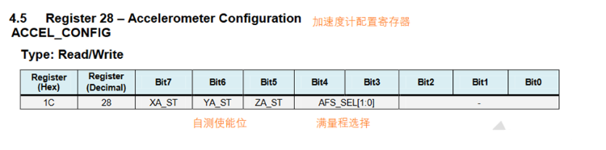

# 1.前言(闲话)
感谢这安信可的活动，感谢群众，还有宝哥，下面很多是查询各种文章缝合而成。会有雷同，但是代码会多多少少进行过修改
# 陀螺仪及MPU6050模块介绍(大同小异可以略过)
## Ⅰ.陀螺仪
陀螺仪是用高速回转体的动量矩敏感壳体相对惯性空间绕正交于自转轴的一个或二个轴的角运动检测装置。利用其他原理制成的角运动检测装置起同样功能的也称陀螺仪。

从力学的观点近似的分析陀螺的运动时，可以把它看成是一个刚体，刚体上有一个万向支点，而陀螺可以绕着这个支点作三个自由度的转动，所以陀螺的运动是属于刚体绕一个定点的转动运动。更确切地说，一个绕对称铀高速旋转的飞轮转子叫陀螺。将陀螺安装在框架装置上，使陀螺的自转轴有角转动的自由度，这种装置的总体叫做陀螺仪。

陀螺仪的原理就是，一个旋转物体的旋转轴所指的方向在不受外力影响时，是不会改变的。人们根据这个道理，用它来保持方向，制造出来的东西就叫陀螺仪。我们骑自行车其实也是利用了这个原理。轮子转得越快越不容易倒，因为车轴有一股保持水平的力量。陀螺仪在工作时要给它一个力，使它快速旋转起来，一般能达到每分钟几十万转，可以工作很长时间。然后用多种方法读取轴所指示的方向，并自动将数据信号传给控制系统。
## Ⅱ.MPU6050模块
简介：

MPU6050内部整合了三轴MEMS陀螺仪、三轴MEMS加速度计以及一个可扩展的数字运动处理器DMP(Digital Motion Processor)，而且还可以连接一个第三方数字传感器(如磁力计)，这样的话，就可以通过IIC接口输出一个9轴信号(链接第三方数字传感器才可以输出九轴信号，否则只有六轴信号)。更加方便的是，有了DMP，可以结合InvenSense公司提供的运动处理资料库，实现姿态解算。通过自带的DMP，可以通过IIC接口输出9轴融合演算的数据，大大降低了运动处理运算对操作系统的负荷，同时也降低了开发难度。其实，简单一句话说，陀螺仪就是测角速度的，加速度传感器就是测角加速度的，二者数据通过算法就可以得到PITCH、YAW、ROLL角了。

特点：

* 以数字形式输出 6 轴或 9 轴（需外接磁传感器）的旋转矩阵、四元数(quaternion)、欧拉角格式(Euler Angle forma)的融合演算数据（需 DMP 支持）
* 具有 131 LSBs/° /sec 敏感度与全格感测范围为±250、±500、±1000 与±2000° /sec的 3 轴角速度感测器(陀螺仪)
* 集成可程序控制，范围为±2g、±4g、±8g 和±16g 的 3 轴加速度传感器
* 移除加速器与陀螺仪轴间敏感度，降低设定给予的影响与感测器的飘移
* 自带数字运动处理(DMP: Digital Motion Processing)引擎可减少 MCU 复杂的融合演算数据、感测器同步化、姿势感应等的负荷
* 内建运作时间偏差与磁力感测器校正演算技术，免除了客户须另外进行校正的需求
* 自带一个数字温度传感器
* 带数字输入同步引脚(Sync pin)支持视频电子影相稳定技术与 GPS
* 可程序控制的中断(interrupt)，支持姿势识别、摇摄、画面放大缩小、滚动、快速下降中断、 high-G 中断、零动作感应、触击感应、摇动感应功能
* VDD 供电电压为 2.5V±5%、 3.0V±5%、 3.3V±5%； VLOGIC 可低至 1.8V± 5%
* 陀螺仪工作电流： 5mA，陀螺仪待机电流： 5uA； 加速器工作电流：500uA，加速器省电模式电流： 40uA@10Hz
* 自带 1024 字节 FIFO，有助于降低系统功耗
* 高达 400Khz 的 IIC 通信接口
* 超小封装尺寸： 4x4x0.9mm（QFN）

MPU6050三轴角(姿态角)

绕向即为正方向，可根据右手螺旋定则确定方向。
MPU6050框图：

可以很清晰地观察到，MPU6050芯片中内置了三轴加速度传感器、三轴陀螺仪和一个温度传感器。右侧INT为中断输出脚，TCS为片选脚、AD0为设置地址脚、SCL和SDA为主IIC接口、AUX_CL和AUX_DA为从IIC接口，主要用到的是AD0、SCL、SDA。

相关寄存器(想深入了解的朋友可以看一下)结合后面的代码更容易理解一些

① 采样频率分频器

这个寄存器可以配置采样频率的分频系数，分频越小，内部的AD转换就越快。数据寄存器刷新就越快。陀螺仪输出率就是陀螺仪时钟。陀螺仪时钟/这个寄存器指定的分频系数=采样频率。

② 配置寄存器

配置寄存器主要分为两个部分：外部同步设置和低通滤波设置：
外部同步设置主要是配置外部帧同步(FSYNC)引脚采样和数字，这里不做配置。
低通滤波器可以让输出数据更加平滑，配置滤波器参数越大，输出的抖动越小。

③ 陀螺仪配置寄存器

高3位是XYZ轴的自测使能位，中间2位是满量程选择位，后面3位没用到。

自测响应=自测使能时的数据-自测使能时的数据。
MPU6050的自测响应的范围如下图所示，在此范围内表示通过自测。

满量程选择：量程越大范围越广，量程越小分辨率越高。在上面的参数介绍中已经有所说明。

④ 加速度计配置寄存器

加速度寄存器的配置与陀螺仪寄存器配置基本上是一个逻辑。

⑤ 加速度计测量寄存器

只读，可以通过这些数据寄存器读取最新的加速度计测量值。
想读取哪个参数，只需要读取对应的数据寄存器即可。XYZ轴的加速度值都是16位的有符号数，以二进制补码的方式存储。读出高8位和低8位，使用int16类型，高位左移8位，或上低位数据，就可以得到数据了。

⑥ 温度测量寄存器

温度传感器的使用与加速度计寄存器基本相同，可以通过读取寄存器值来获取温度。

⑦ 陀螺仪测量寄存器

陀螺仪数据寄存器和加速度计测量寄存器也是同样的用法，只需要读取相应的寄存器就可以获得相应的测量数值。数据的存储方式还是16位的有符号数，以二进制补码的方式存储。

⑧ 电源管理寄存器1

Bit7设备复位，这一位写1，所有寄存器都恢复到默认值。
Bit6睡眠模式，这一位写1，芯片睡眠，进入低功耗。
Bit5循环模式，这一位写1，芯片进入低功耗，过一段时间，启动一次，唤醒的频率由下面电源管理寄存器的Bit7和Bit6决定。
Bit3温度传感器失能，写1之后，禁用内部的温度传感器。
Bit2-0，选择系统的时钟来源。可选择：内部晶振、X/Y/Z轴陀螺仪晶振，外部引脚的两个方波，一般选择内部晶振或者陀螺仪晶振。建议使用陀螺仪晶振，更加精确。

⑨ 电源管理寄存器2
 Bit5-Bit0，可以分别控制6个轴进入待机模式，如果只需要部分轴的数据，可以让其他轴待机，这样比较省电。
Bit7-Bit6，是上面电源管理寄存器1的循环模式的唤醒频率。

注意：可以使用此寄存器将单个加速度计和陀螺仪轴置于待机模式。如果设备使用陀螺仪轴作为时钟源，并且该轴处于待机状态，时钟源将自动更改为内部8MHz振荡器。

⑩ ID号寄存器
ID号不可修改，中间6位固定为110100，最高位和最低为都是0，读出寄存器，值固定为0x68。
实际上ID号就是I2C的地址，但是有区别的是，I2C地址可以通过AD0引脚进行配置，这里的AD号最低位是不随AD0引脚的变化而变化的。

#### 注意 
所有的寄存器上电默认值都是0x00，除了107号（电源管理寄存器1），上电默认0x40，117号寄存器（ID号），上电默认0x68。
电源管理寄存器1默认0x40，表示睡眠模式，所以在操作MPU6050之前，要先解除睡眠，否则操作其他寄存器是无效的。

### 硬件连接

VCC:接5V电源

GND:接地

SCL:主IIC时钟线 (我接的PB10)

SDA:主IIC数据线 (我接的PB11)

AD0:地址线，接3V地址为0x68，接地地址为0x69（我接的PA15，高电平，地址为0x68）